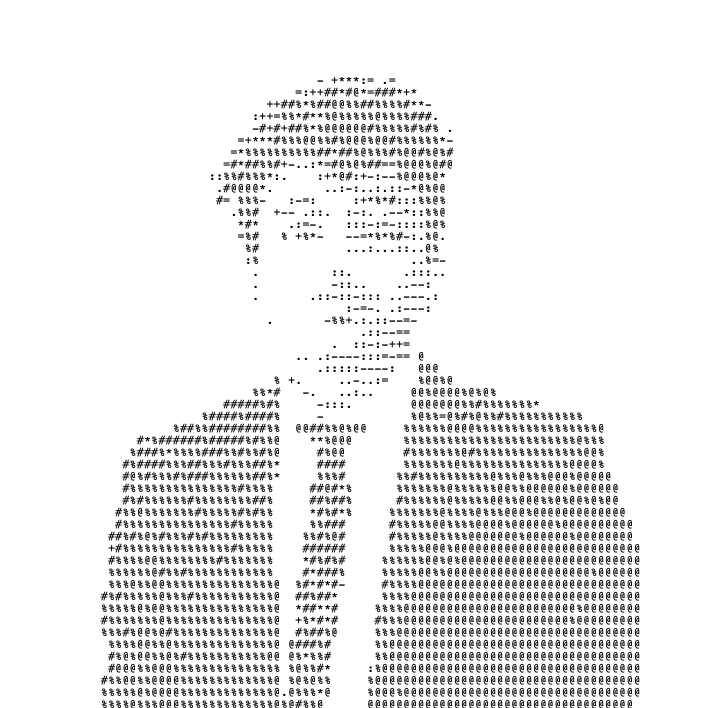

<!-- TYPING INTRO -->

 

 

<!-- SOCIAL BADGES -->

---

## What I build

I'm a Product Manager at **Goldman Sachs** working on the Core Data Platform. I work at the intersection of AI/ML, data, consumer tech products and I care deeply about making complex systems actually usable.

---

## Stack I work closest to

---

<!-- GITHUB STATS -->

&nbsp;&nbsp;

  

<!-- FOOTER WAVE -->

